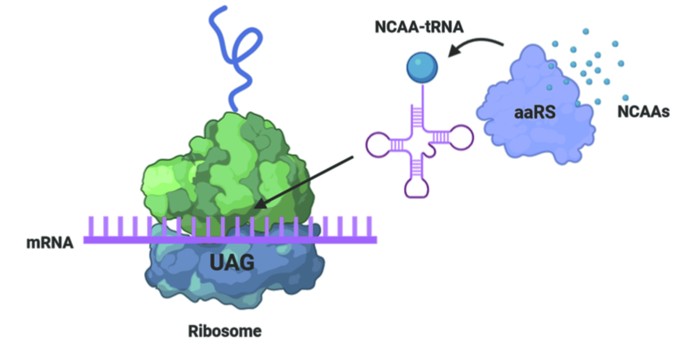

# aaRS Engineering Pipeline 🧬

## A Scalable Pipeline for the Discovery of aaRS Mutants to Aid in Genetic Code Expansion.

## Introduction
Aminoacyl-tRNA Synthetases (aaRSs) are a class of enzyme central to translation,
facilitating the interaction of tRNAs to a cognate canonical amino acid (CAA).
To enable expansion of the natural chemical toolbox to encompass non-canonical
amino acids (NCAAs), new enzymes of this class have to be enginereed to accept
the alternative chemistries offered by NCAAs, while remaining inert to
pre-existing CAAs.

## Workflow
The engineering workflow facilitates structure prediction of mutant enzymes
through  energy minimization, followed by blind docking of
native and target (exogenous) amino acids by .

## Scoring
**Delta:**
* NCAA Dock Score - Native Dock Score
* Lower the score, the greater the engineered affinity for the NCAA over the
native substrate\
**RMSD:**
* Root-Mean-Square Deviation of the exogenously docked NCAA to the crystal-structure
derived docking position of the native amino acid
* Estimation metric of the mutant producing a productive docking pose with the
target NCAA
* Lower the RMSD, the greater the mutant appears to dock the NCAA in a
productive binding pose.
